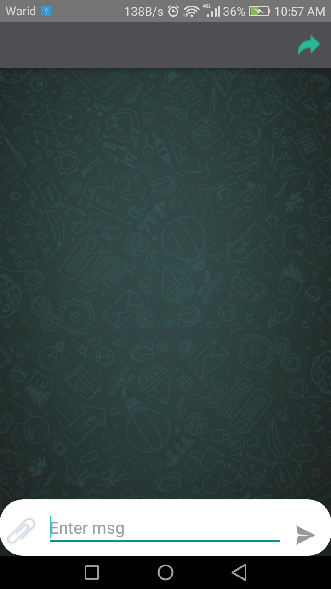
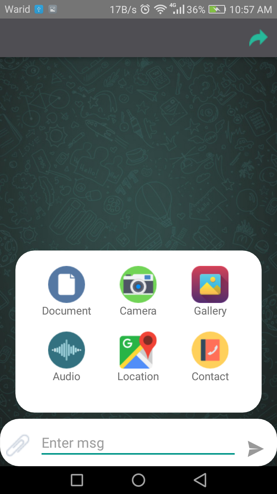
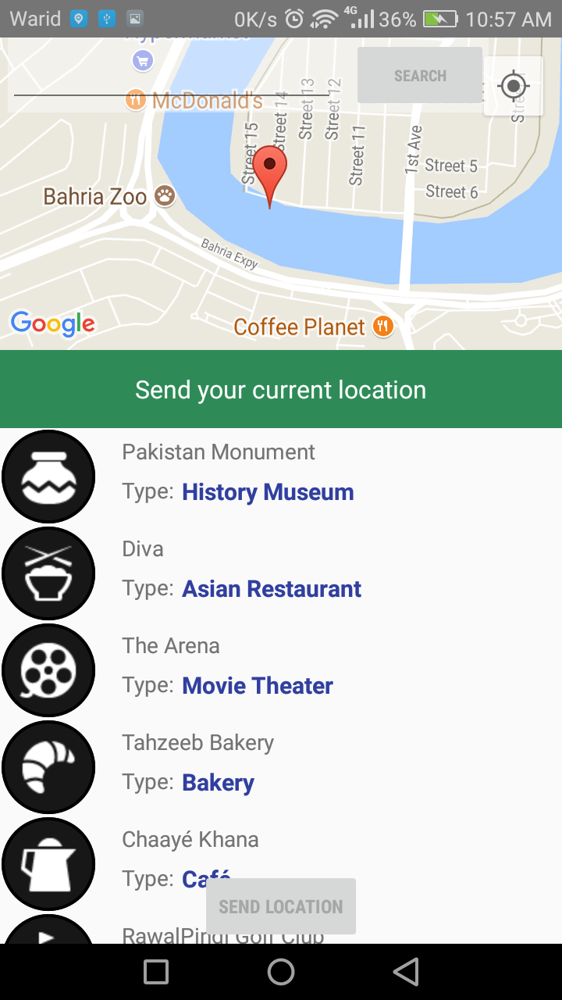

##Android Simple Chat View

A sample Android App which can be used for a chat application.

###What it includes?

* Native Emoji Keyboard - Same as found in WhatsApp
* Chat bubbles - Modeled after WhatsApp
* Chat attachements
* Chat messages forward in same chat
>

#Screenshots

